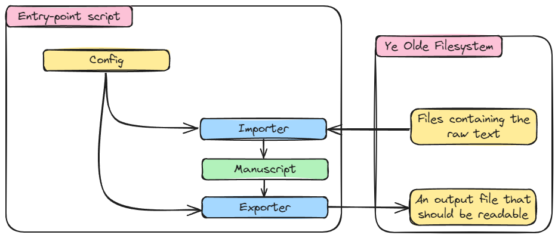
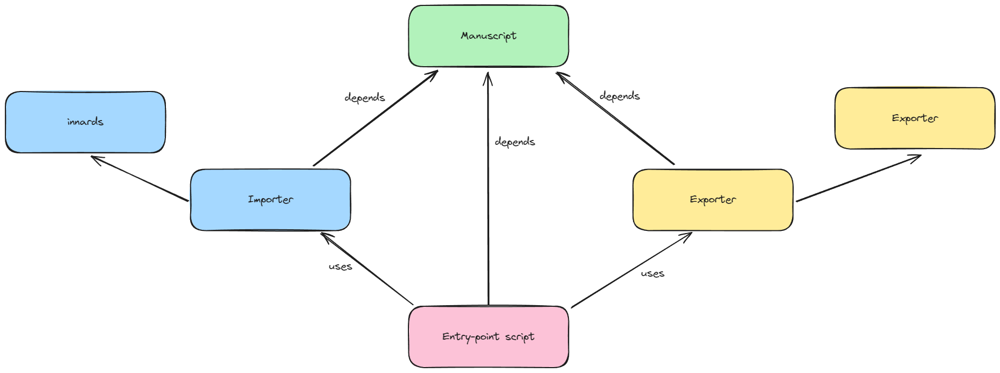

## Welcome!

The Manuscript Generator 3000 is a tool for generating publishable (ish) documents from manuscripts.

The essential idea is that

- You have a manuscript for some written work (novel, novella, etc) that is made up of multiple files.
- You would like that manuscript to be compiled into something you can read on some other device -- say for marking up edit notes -- or even to submit for publishing.

If both of the above are true, you're in luck!

There's a little example of how this works here: [Example Manuscript](<example/The Unimaginative Software Engineer.md>).

## Usage

The essential premise is that for each kind of manuscript we will have an entry-point script, which defines some configuration to pass into a 3-stage pipeline:



This all hinges on the concept of a `Manuscript`. In this package, a `Manuscript` is an intermediate representation that *should* be able to deal with *any* manuscript, i.e. it is meant to abstract away the particularities of whatever writing software you use (in my case I use Obsidian) into a representation that can more easily be transformed.

The first stage, the `importer` is responsible for taking raw files (in whatever format they may be) and turn them into a `Manuscript`. The entry-point script will then hold an instance of a `Manuscript` that should contain all of the config and content that make up the manuscript.

This can then be passed to any number of exporters. (See this in action in [the example](example/compile_example.py)!)

So usage of the package starts with writing up your own entry-point script, derived from the example if you so desire. For my purposes, I tend to have an entry-point script that lives close to my text for each kind of manuscript; i.e. for each kind of combination of importer/exporter I may need to use. I find this an acceptable tradeoff between trying to have a main script in the package that can deal with *any* case (which would be a pain) and having some of the configuration simply live in the code.

Again, have a look at the example :)

## Code Structure



The code is structured in the simplest way I could think of.

Entry point scripts depend on the top-level interfaces of importers and exporters and also (implicitly if need be) on the Manuscript class itself. Importers and Exporters are then allowed to depend on Manuscript as well, as they need to understand it to define their interfaces, as well as any number of "innards" libraries they might need.

## Unit tests

Just do the usual:

```
pytest
```

which should find all of the unit in the package.

## TODO

Like any good open-source project, this one has a massive TODO list I'm working on :)

- MVP
	- [x] Add index file importer
	- [x] Add PDF (via latex) exporter
	- [x] Add example
	- [x] Add docs
- Functionality
	- [ ] Support chapter and part titles.
	- [ ] Support un-numbered chapters.
	- [ ] ... and remove the prologue special case.
	- [ ] Make the single-file (short story) importer use the name of the file as a title if no title config is provided.
	- [ ] Add configurable (optional) table of contents
- Code quality
	- [ ] Clean up TODOs in the code (a few are still lurking around)
	- [x] Break up code into sub-packages
	- [ ] Clean up path shenanigans
	- [ ] Add (more) unit tests :)
- Appearance
	- [ ] Introduce a better cover for when no cover is specified in config.